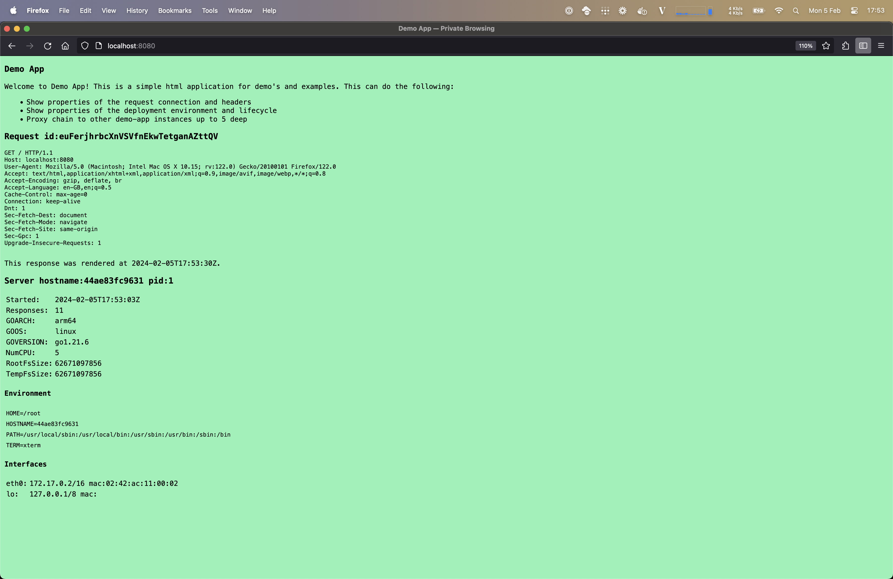
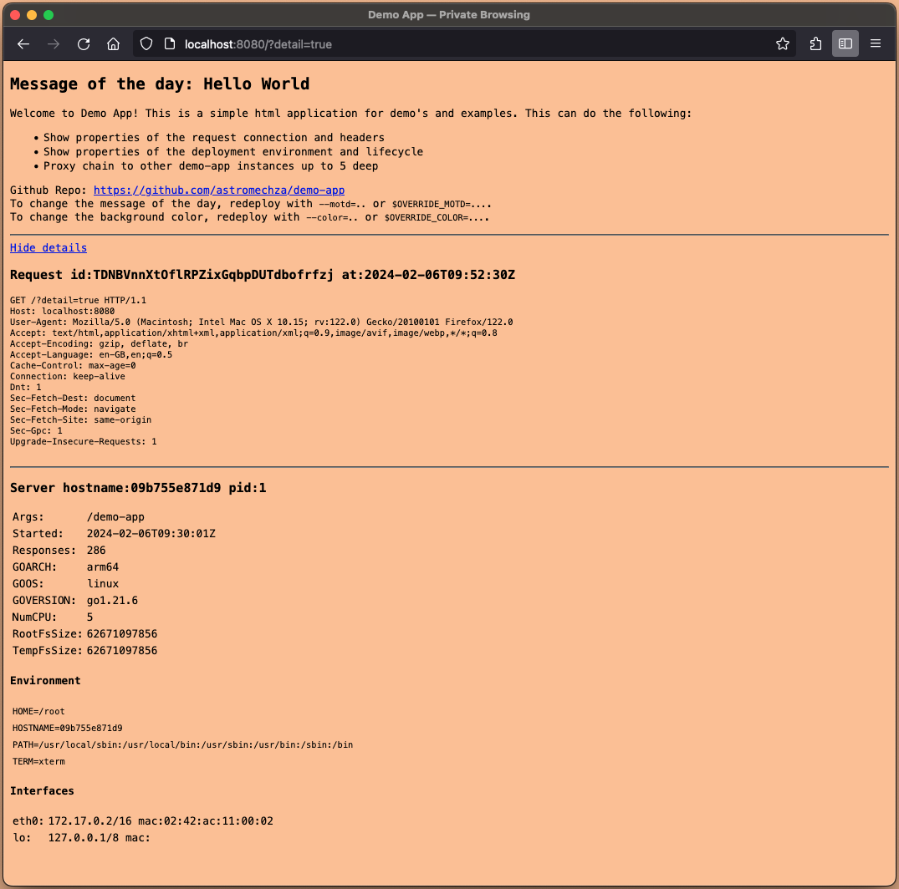

# demo-app

A small http UI echo server to use as a platform engineering example application. This listens with HTTP on port `8080`
and can output various facts about the request and server. This is great for demonstrating:

- Deployment lifecycle
- Customisation of environment variables of files in the container
- Customisation of container resources
- Load-balancing between replicas
- Autoscaling based on request rate





## Docker image for Linux

```sh
docker pull ghcr.io/astromechza/demo-app:v0.1.0
```

## Go binary

To install the binary into your own image or system, do the following and it should be available on `$GOPATH/bin/demo-app`.

```
go install github.com/astromechza/demo-app@v0.1.0
```

## Options

The following flags are available and may also be set through the `OVERRIDE_<flag uppercase>` environment variables.

```
  -color string
    	the background color to display (default "random")
  -listen string
    	the address to listen on (default ":8080")
  -motd string
    	specify a message of the day, prefix with '@' to read from a file (default "Hello World")
  -proxy string
    	forward the request to the given http or https endpoint
```
