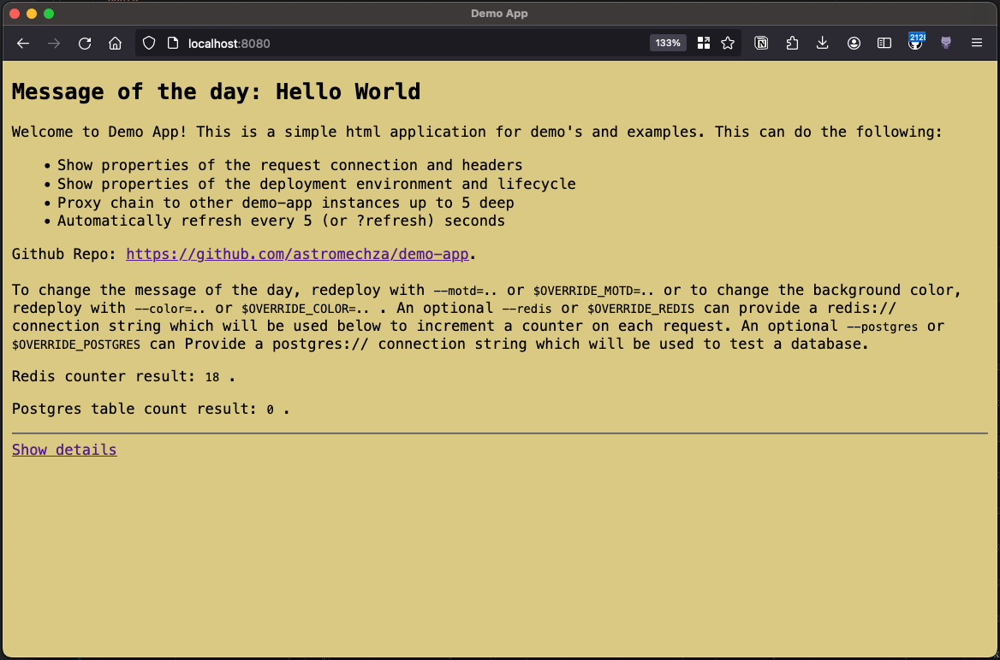

# demo-app

A small http UI echo server to use as a platform engineering example application.



## Docker image

TODO

## Options

The following flags are available and may also be set through the `OVERRIDE_<flag uppercase>` environment variables.

```
  -color string
    	the background color to display (default "random")
  -listen string
    	the address to listen on (default ":8080")
  -motd string
    	specify a message of the day, prefix with '@' to read from a file (default "Hello World")
  -proxy string
    	forward the request to the given http or https endpoint
```
