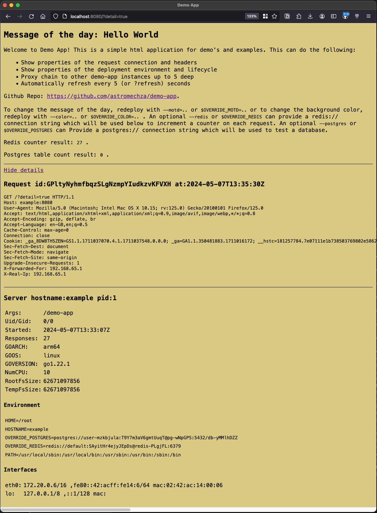

# demo-app

A small http UI echo server to use as a platform engineering example application. This listens with HTTP on port `8080`
and can output various facts about the request and server. This is great for demonstrating:

- **Deployment lifecycle**
  - Update the message-of-the-day or background color, redeploy, and watch the replicas update.
- **Customisation of environment variables and files in the container**
  - For example, a different message-of-the-day per environment.
- **Customisation of container resources**
  - The detailed drop down shows the platform and number of cpus available.
- **Load-balancing between replicas**
  - The HTTP endpoint and readiness checks can be used as a load balancing target.
  - The HTTP page reloads itself every few seconds to continuously generate requests.
- **Demonstrating a Redis and/or Mysql/Postgres connection**
  - A counter is stored in Redis, and a query is performed against a database to validate the connection.




## Docker image for Linux

```sh
docker pull ghcr.io/astromechza/demo-app:latest
```

## Go binary

To install the binary into your own image or system, do the following and it should be available on `$GOPATH/bin/demo-app`.

```
go install github.com/astromechza/demo-app@latest
```

## Options

The following flags are available and may also be set through the `OVERRIDE_<flag uppercase>` environment variables.

```
  -color string
    	the background color to display (default "random")
  -listen string
    	the address to listen on (default ":8080")
  -motd string
    	specify a message of the day, prefix with '@' to read from a file (default "Hello World")
  -postgres string
    	Optional postgres url 'postgres://<user>:<pass>@<host>:<port>/<database>'
  -mysql string
    	Optional postgres url '<user>:<pass>@tcp(<host>:<port>)/<database>'
  -proxy string
    	forward the request to the given http or https endpoint
  -redis string
    	Optional redis url 'redis://<user>:<pass>@<host>:<port>'
```

## Running with Score

A [Score](https://score.dev/) file is provided in [score.yaml](./score.yaml) which can be used to easily run this demo
with the postgres and redis provisioned.

```
score-compose init
score-compose generate score.yaml --image ghcr.io/astromechza/demo-app:latest
docker compose up -d
score-compose resources get-outputs 'dns.default#example.dns' --format 'http://{{.host}}:8080'
```
